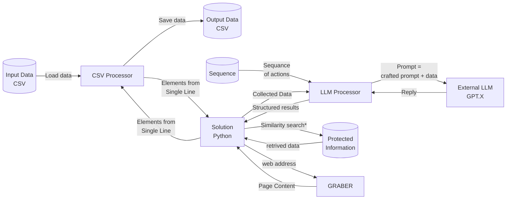

# CSV Analytics

The goal: create a simple solution for data analytics, based on LLM models, the open-source platform LangChain, Python as a main programming language, and CSV format as an input/output data format.
The main approach will be tested on business applications but is meant to be retargeted for real purposes.

## Concept

## How to start

1. Update enviroment via given script

```ssh
> ./deploy.sh
```

## Terminology

- [Input Data](IN): A dedicated CSV file is given as a parameter or found in a predefined relative to the executable directory;
- [Output Data](OUT): Newly created file or existing (if the process needs to be continued) name based on the name of **Input Data** file with added prefix "results_";
- [CSV Processor](PARSER): Class/module/program dedicated to operating with CSV and providing the next functionality:
  - read data from the input file
  - write data to the output file
  - by the request get data from the (n) line of the input file
  - by request append line to the output file, with a copy of input information, extended by the new given data array
  - resolve file location issues
- [LLM Processor](ANALYZER): Class/module/program dedicated to cooperating with external LLM model via LangChain framework, and process given data with a given sequence of actions with given prompts for each stage. 
- [Processor Instructions](INSTRUCTIONS) The sequence of **Processor** shall be described by an editable JSON file with the proposed format (could be revised):

```json
{
    ...
    "Step (X)": {
        "IN1": "CSV:3",
        "IN2": "CSV:6",
        "OUT": "CSV:0", 
        "PROMPT": "Analise given information {IN1} in text {IN2} and sumarise results",
        ...
    },
    "Step (X+1)": {
        "PROMPT": "Sumarise next results {Step (X)} in text {Step (X-1)} and sumarise results",
        ...
    },
    ...
}
```

- [Collected Data](DATA): Data record (Json like) generated from data, received from CSV  



## User Story

1. The **USER** provides CSV file with input data and a specific Process configuration file in **JSON** format. After the application is executed, the resulting data will be stored in the Output CSV file, with a full copy of input (**IN**) data, followed by resulting (**OUT**) data.
2. The CSV files are processed by **PARSER** and after parsing each line **ANALYZER** shall be called with an input buffer from a single line of CSV file enriched with data from **WEB** and **DB**.
3. The **GRABER** shall take the web address and return only text information from the main body of the page (Test needed), to enrich the input buffer for further processing. Graber shall have the function to detect "is given text is web link", to simplify PoC main program.
4. The **ANALYZER** takes as input **JSON** file with step-by-step instructions and processes them in the way:
   - Field "prompt" shall be taken as a template for the LLM Prompt creation, and each instance of {link} replaced with appropriate decoded information;
   - Fields "INx" and "OUTx" refer to the CSV file columns or other sources (**DB** Indexes);
   - Some other links like LLM parameters could be stored in a JSON file. TBD.
Field OUT refers to the location results of LLM processing to be stored.
5. The input CSV file has columns, and they are addressed by names like {CSV:X}, where **X** is the position of columns starting from "0";

## Architecture

## Done

## TODO List 