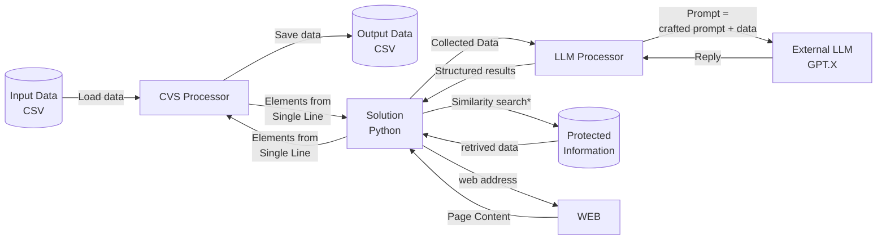

# CSV Analytics

The goal: create a simple solution for data analytics, based on LLM models, the open-source platform LangChain, Python as a main programming language, and cvs format as an input/output data format.
The main approach will be tested on business applications but is meant to be retargeted for real purposes.

## Concept

## Terminology

- [Input Data](IN): A dedicated CVS file is given as a parameter or found in a predefined relative to the executable directory;
- [Output Data](OUT): Newly created file or existing (if the process needs to be continued) name based on the name of **Input Data** file with added prefix "results_";
- [CSV Processor](PARSER): Class/module/program dedicated to operating with CSV and providing the next functionality:
  - read data from the input file
  - write data to the output file
  - by the request get data from the (n) line of the input file
  - by request append line to the output file, with a copy of input information, extended by the new given data array
  - resolve file location issues
- [LLM Processor](ANALYZER): Class/module/program dedicated to cooperating with external LLM model via LangChain framework, and process given data with a given sequence of actions with given prompts for each stage. The process may be described by an editable JSON file in the form of (could be revised):

```json
{
    ...
    "Step (X)": {
        "IN1": "CSV:3",
        "IN2": "CSV:6",
        "OUT": "CSV:0", 
        "PROMPT": "Analise given information {IN1} in text {IN2} and sumarise results",
        ...
    },
    "Step (X+1)": {
        "PROMPT": "Sumarise next results {Step (X)} in text {Step (X-1)} and sumarise results",
        ...
    },
    ...
}
```

- [Collected Data](DATA): Data record (Json like) generated from data, received from CSV  




## Architecture

## Done

## TODO List 